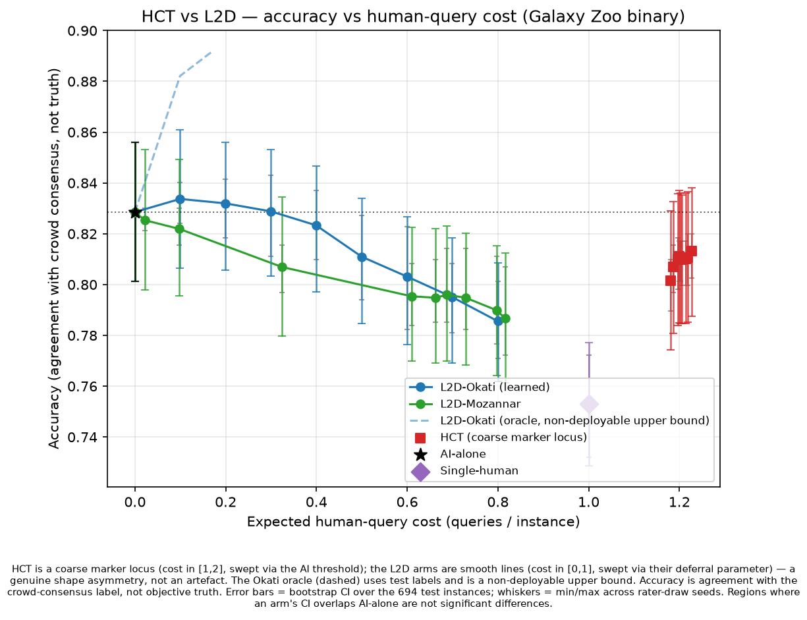

# Auditability, not accuracy: a head-to-head of Hybrid Confirmation Trees and Learning-to-Defer on Galaxy Zoo

## 1. Framing and contribution

Human–AI decision pipelines are usually evaluated within a single family of methods: a
learning-to-defer (L2D) method against other L2D methods, or a confirmation rule against a
single-human or AI-alone baseline. In learning to defer, a policy routes some inputs to a human
instead of letting the model decide, trading the cost of querying a human for accuracy. The Hybrid
Confirmation Tree (HCT) of Berger et al. (HCT-1, arXiv:2602.02375; follow-up HCT-2,
arXiv:2603.29866) and the L2D line of Okati, De & Gómez-Rodríguez (NeurIPS 2021, arXiv:2103.08902)
and Mozannar & Sontag (ICML 2020, arXiv:2006.01862) have, to our knowledge, never been compared
head-to-head on a shared dataset, backbone, and evaluation split. That comparison is the
contribution here. The Pareto plot is only its visualization. We adopt the cost–accuracy trade-off
framing of De Toni et al. (NeurIPS 2024, framing only; not implemented).

The result is a null: on the Galaxy Zoo binary task, with a shared strong AI backbone, no
deployable human-in-the-loop arm significantly beats AI-alone.

## 2. Dataset and the non-expert-rater caveat

HCT constrains the choice of dataset twice over. It is defined only for binary decisions, and it
needs real per-image multi-rater vote counts, on the order of 30 labels per image, to draw the two
simulated humans it consults. CIFAR-10H and ImageNet-16H are multiclass, so HCT is undefined on
them. HAM10000 ships no per-rater labels, so the
second human draw is impossible. Brinker's evaluation set of roughly 200 images has no statistical
power. Good Judgment Open is probabilistic forecasting with resolution lag, not instance-level
classification. Galaxy Zoo is the only candidate that is binary, carries 30+ real labels per image,
and ships with an original L2D author's code (Okati's), which removes one re-implementation. Once we
chosen, the same two constraints left no alternative.

We use the Galaxy Zoo binary 10k subset (spiral vs. early-type/smooth) that Okati 2021 uses (their
footnotes 8–9), sourced from the Kaggle Galaxy Zoo Challenge aggregate vote fractions. Each image
carries an urn of per-label vote counts over its 30+ raters. Drawing a simulated human means
sampling one label from that urn: HCT draws a first human `h1`, and on disagreement a second `h2`. A
drawn human is right or wrong about as often as a real volunteer. HCT
needs these real per-rater counts, which Okati's repository does not ship. The Kaggle competition
had anonymised its galaxy IDs, so the counts could not be looked up directly. We recover them by
matching each Kaggle galaxy's vote signature to the Willett et al. 2013 GZ2 catalog through a
content-based crosswalk: 5,904 of 10,000 images (59%) match at high precision. After dropping
`star_or_artifact`-mode galaxies and images with too few votes for a without-replacement draw,
N = 4,621 survive (train 3,234 / val 693 / test 694). The matched subset is morphologically
representative (binary-hardness 0.52 vs. 0.48 overall), so the 41% drop is not a difficulty-selected
bias. Coverage is 59%, not the full set.

The raters are Galaxy Zoo citizen-science volunteers, not domain experts; Okati's "human experts" is
loose terminology. This matters concretely. The single-human accuracy ceiling is the volunteer
crowd's, not an astronomer's. HCT's tie-breaking second draw `h2` comes from the same volunteer vote
distribution, so on genuinely ambiguous galaxies it is right only about as often as a coin flip.
Both effects depress the headroom available to any human-querying arm. The "ground truth" `y` is
itself the crowd-consensus majority, so every accuracy below is agreement with consensus, not with
objective truth (§6).

## 3. Methods and the invariants that make the comparison fair

- **AI-alone** — the shared backbone thresholded at 0.5 (cost 0).
- **Single-human** — one urn draw per image (cost 1).
- **HCT** (HCT-1, Fig. 1): the human `h1` and the binarized AI decide independently. If they agree,
  accept (cost 1). If they disagree, draw `h2` and take its call (cost 2). Expected human cost is
  `1 + P(human–AI disagree)`, bounded in [1, 2], swept via the AI binarization threshold θ, the only
  HCT knob. HCT is a decision rule, not a trained model.
- **L2D-Okati** (Thm. 3): for a fixed classifier, the optimal triage thresholds the per-instance gap
  between expected machine and human loss; a budget `b` caps the deferral fraction. Cost is the
  deferral fraction ∈ [0, 1].
- **L2D-Mozannar** (eq. 10): the consistent convex surrogate `L_CE^α`; the deferral knob α sweeps a
  smooth curve. Cost is the deferral fraction ∈ [0, 1].

**Shared-backbone and frozen-split invariants.** Every arm consumes the same committed backbone
scores and embeddings, and the same seed-0 70/15/15 split, guarded by a hash check. One shared
metrics module computes all numbers.

**Deviation: Option B.** The L2D papers co-train classifier and rejector. We instead freeze the
shared backbone and learn only the rejector on top of its embeddings. This is deliberate.
Co-training would give each L2D arm a different classifier, confounding the comparison with backbone
differences. Freezing makes the AI identical across all arms, so any measured gap is attributable to
the deferral policy alone. It removes a confound. The cost is that we measure these methods' triage
quality, not their end-to-end co-training, and we do not import their co-trained accuracy claims
here.

## 4. Results

The horizontal axis, expected human-query cost, is the expected number of human labels queried per
decision: 0 for AI-alone, 1 for a single query, and up to 2 when HCT consults a second human. All
numbers come from the released results table. CIs are 95% bootstrap over the 694 test instances,
with stochastic arms also resampled across rater-draw seeds [0–4].

| Arm (policy) | Accuracy [95% CI] | Cost | vs AI-alone | Deployable |
|---|---|---|---|---|
| **AI-alone** | **0.829 [0.801, 0.856]** | 0 | — (baseline) | yes |
| L2D-Okati (learned), b=0.1 | 0.834 [0.806, 0.861] | 0.10 | ns (CI overlaps) | yes |
| L2D-Mozannar (best deferral, α=0.95) | 0.822 [0.796, 0.849] | 0.10 | ns (CI overlaps), below mean | yes |
| HCT (θ=0.1) | 0.813 [0.788, 0.838] | 1.23 | ns (CI overlaps), below mean | yes |
| Single-human | 0.753 [0.729, 0.777] | 1.00 | below (CI excludes 0.829) | yes |
| L2D-Okati (**oracle**), b≈0.2 | 0.892 [0.871, 0.911] | 0.17 | above, but non-deployable | no |

**Curve-shape and cost-regime asymmetry.** HCT is a coarse marker locus, drawn as discrete markers.
Sweeping θ moves its expected cost only within a narrow band, observed here as 1.18–1.23, because
cost is `1 + P(disagree)` and is structurally bounded in [1, 2]. The L2D arms are smooth lines whose
cost ranges over [0, 1]. The two methods therefore live in disjoint cost regimes, L2D in [0, 1] and
HCT in [1, 2], and are not mutually Pareto-comparable point for point. HCT is never drawn as a
continuous curve. This is a property of the methods, not of the plotting.

**Reading the arms.** L2D-Okati (learned) peaks at 0.834 at cost 0.10, then declines as more, often
correct, machine decisions are handed to noisier humans. Mozannar's best deferral point (0.822) sits
below AI-alone in the mean, though its CI still overlaps, and degrades further with deferral. HCT's
accuracy is flat at about 0.81 across θ and sits below AI-alone in the mean. The Okati oracle
(dashed) peeks at test labels to triage perfectly and climbs to 0.892, but it is a non-deployable
upper bound and is excluded from the deployable frontier.

## 5. Central finding (an honest null)

No deployable arm significantly beats AI-alone. The verdict is computed mechanically in evaluation.
Every deployable arm's CI either overlaps AI-alone (L2D-Okati-learned, HCT, Mozannar) or sits
strictly below it. Single-human is the only arm whose CI excludes 0.829, and it is significantly
worse. L2D-Okati-learned's +0.5 pt mean at cost 0.10 is within noise, and HCT's mean is below
AI-alone at cost above 1.

Interpretation: on consensus-labeled Galaxy Zoo with a strong AI, human deferral buys auditability,
not accuracy. HCT's value is that at least one human always approves the deployed decision, at a
bounded, transparent, training-free cost. That is a governance property, not an accuracy gain. The
oracle shows about 6 points of headroom exists in principle, but it is unrealizable with a
deployable rejector on these frozen embeddings, because the learned triage cannot identify which
machine errors a volunteer would fix.

**Upstream self-claims are not findings here.** HCT-1 reports 28–44% cost savings on its own
datasets. That is a property of those datasets, not a result on Galaxy Zoo, and we do not import it.
Likewise we measure the L2D arms' triage over a frozen backbone (Option B), not their co-trained
end-to-end numbers. Every claim in this report traces to a released artifact.

## 6. Limitations

- **Single dataset, single backbone.** One task (Galaxy Zoo binary), one frozen ResNet-50. No claim
  generalizes beyond this setting.
- **Accuracy = agreement with crowd consensus, not truth.** Because `y` is the volunteer majority, a
  single human's accuracy is the majority vote share by construction, and HCT's `h2` is ~50% on
  near-split galaxies by construction. This compresses inter-arm gaps and is a threat to the
  comparison itself.
- **Non-expert raters** (§2): the human ceiling and the `h2` tiebreak are volunteer-quality.
- **59% crosswalk coverage** (§2): 4,621 of 10,000; disclosed, representative, but not complete.
- **Urn structural limits.** `h1 ⊥ h2 | x` is enforced, since both are independent draws from the
  same per-image distribution, so `h2` is a second *draw*, not a second *human*. The positive
  human–human correlation Berger studies lives only in between-image urn-composition variance, and
  the opinion-leader (ρ) reconstruction is not supported by aggregate counts.
- **Option-B deviation** (§3): triage-only, not the papers' co-training; removes a backbone confound
  but does not evaluate end-to-end co-training.
- **Reproducibility.** The code and frozen artifacts needed to reproduce this report's figure and
  table are released, and regeneration is deterministic. The one-off backbone training and embedding
  export, and the raw-catalog label build sit upstream of that interface and are not re-run.
